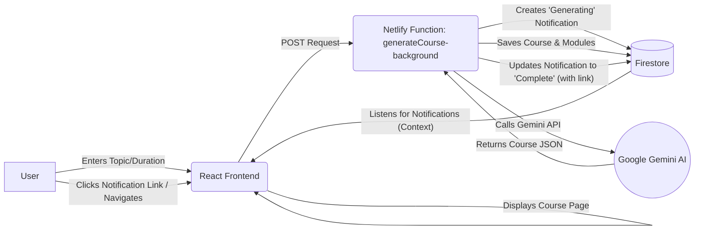

# ALEA - Agnostic Learning Assistant

**A sophisticated, AI-powered web application designed to create personalized educational courses.**

---

## 🚀 Introduction

ALEA is a platform that leverages the power of generative AI to create dynamic, high-quality educational content. Users can specify a topic and a duration, and the application will generate a complete, day-by-day course curriculum, including detailed lesson materials and flashcards.

This project is built with a modern, scalable, and maintainable tech stack, designed to deliver a seamless user experience and robust backend processing.

---

## ✨ Key Features

*   **AI-Powered Course Generation:** Automatically generate comprehensive course syllabi using Google's Gemini AI.
*   **Detailed Lesson Creation:** Each module in a course is populated with detailed, well-structured learning materials.
*   **Flashcard Generation:** Automatically create flashcards for each lesson to aid in learning and revision.
*   **User Authentication:** Secure user authentication and data management powered by Firebase.
*   **Asynchronous Job Handling:** Course and lesson generation are handled as background jobs, providing a non-blocking user experience.
*   **Real-time Notifications:** Users are kept informed of the status of their requests through a real-time notification system.
*   **Modern, Responsive UI:** A clean, intuitive, and responsive user interface built with React and Tailwind CSS.

---

## 🛠️ Tech Stack

*   **Frontend:**
    *   [React](https://reactjs.org/)
    *   [Vite](https://vitejs.dev/)
    *   [Tailwind CSS](https://tailwindcss.com/)
    *   [shadcn/ui](https://ui.shadcn.com/)
    *   [React Router](https://reactrouter.com/)
    *   [Framer Motion](https://www.framer.com/motion/)
*   **Backend:**
    *   [Netlify Functions](https://www.netlify.com/products/functions/) (Serverless)
*   **Database & Auth:**
    *   [Google Firebase](https://firebase.google.com/) (Firestore & Authentication)
*   **AI:**
    *   [Google Gemini](https://ai.google.dev/)

---

## ⚙️ Getting Started

### Prerequisites

*   [Node.js](https://nodejs.org/) (v18 or higher)
*   [npm](https://www.npmjs.com/)
*   A Firebase project
*   A Google AI API Key

### Installation

1.  **Clone the repository:**
    ```bash
    git clone https://github.com/your-username/agnostic-learning-engine.git
    cd agnostic-learning-engine
    ```

2.  **Install dependencies:**
    ```bash
    npm install
    ```

3.  **Set up environment variables:**
    Create a `.env.local` file in the root of the project and add the necessary environment variables. See the [Environment Variables](#-environment-variables) section for more details.

### Running the Development Server

```bash
npm run dev
```

This will start the Vite development server, and you can view the application at `http://localhost:5173`.

---

## 🏗️ Project Architecture

### Frontend

The frontend is a dynamic single-page application (SPA) developed with **React** and bundled using **Vite**. It provides a rich, interactive user experience, managing client-side routing with **React Router** and enhancing visual appeal and responsiveness with **Tailwind CSS** and **shadcn/ui** components. Key aspects include:
*   **Component-Based Architecture:** Modular and reusable React components for UI elements.
*   **State Management:** Utilizes React Context for global state, specifically for `ThemeContext` and `NotificationContext`, ensuring consistent theming and real-time user feedback.
*   **Asynchronous Interactions:** Communicates with Netlify Functions to trigger AI-driven content generation and Firebase for data persistence and authentication.

### Backend

The backend operates on a **serverless architecture** powered by **Netlify Functions**. This design ensures high scalability, cost-efficiency, and automatic scaling based on demand. The core responsibilities of the backend functions include:
*   **AI Content Generation:** Interacts with the **Google Gemini AI** to generate course curricula (`generateCourse-background.js`), detailed lesson materials (`generateLesson-background.js`), and flashcards (`generateFlashcards-background.js`).
*   **Asynchronous Processing:** AI generation tasks are handled as background jobs, preventing UI blocking and providing a smooth user experience.
*   **Firebase Integration:** Securely interacts with Firebase Firestore and Authentication using `firebase-admin` to manage data and user sessions.
*   **Notification System:** Manages real-time notifications to inform users about the status of their content generation requests.

### Database

**Google Cloud Firestore** serves as the primary NoSQL database, offering real-time data synchronization and robust scalability. It is structured to store:
*   **User Data:** Profiles and authentication details.
*   **Courses:** High-level course information, including titles, duration, and status.
*   **Modules:** Detailed daily learning modules associated with each course, containing lesson material and descriptions.
*   **Flashcards:** Question-and-answer pairs generated for specific modules.
*   **Notifications:** Real-time updates on the status of AI generation tasks, linked to user accounts.
*   **Authentication:** Handled by **Firebase Authentication**, providing secure user sign-up and login capabilities.

### System Architecture Diagram



---

## 🔑 Environment Variables

To run this project, you will need to add the following environment variables to your `.env.local` file:

```
# Firebase Configuration
VITE_FIREBASE_API_KEY=your_firebase_api_key
VITE_FIREBASE_AUTH_DOMAIN=your_firebase_auth_domain
VITE_FIREBASE_PROJECT_ID=your_firebase_project_id
VITE_FIREBASE_STORAGE_BUCKET=your_firebase_storage_bucket
VITE_FIREBASE_MESSAGING_SENDER_ID=your_firebase_messaging_sender_id
VITE_FIREBASE_APP_ID=your_firebase_app_id
VITE_FIREBASE_MEASUREMENT_ID=your_firebase_measurement_id

# Google Gemini API Key
VITE_GEMINI_API_KEY=your_gemini_api_key

# Firebase Service Account (for backend functions)
# This should be a Base64 encoded string of your service account JSON file
FIREBASE_SERVICE_ACCOUNT_BASE64=your_base64_encoded_service_account
```

---

## 📜 Available Scripts

In the project directory, you can run:

*   `npm run dev`: Runs the app in development mode.
*   `npm run build`: Builds the app for production.
*   `npm run lint`: Lints the codebase.
*   `npm run preview`: Previews the production build.

---

## 🚀 Deployment

This application is designed to be deployed on [Netlify](https://www.netlify.com/). The `netlify.toml` file in the root of the project contains the necessary configuration for deployment.

### Netlify Configuration (`netlify.toml`)

The `netlify.toml` file defines how your project is built and deployed on Netlify. Key configurations include:

*   **`[build]`**:
    *   `functions = "netlify/functions"`: Specifies that your serverless functions are located in the `netlify/functions` directory.

*   **`[dev]`**:
    *   `framework = "#custom"`: Indicates a custom framework setup for local development.
    *   `command = "npm run dev"`: The command Netlify Dev will run to start your local development server.
    *   `targetPort = 5173`: The port where your Vite development server runs.
    *   `port = 8888`: The port Netlify Dev will use to proxy your application.

---
